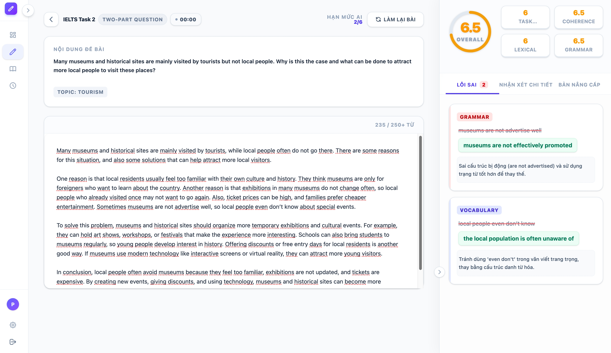
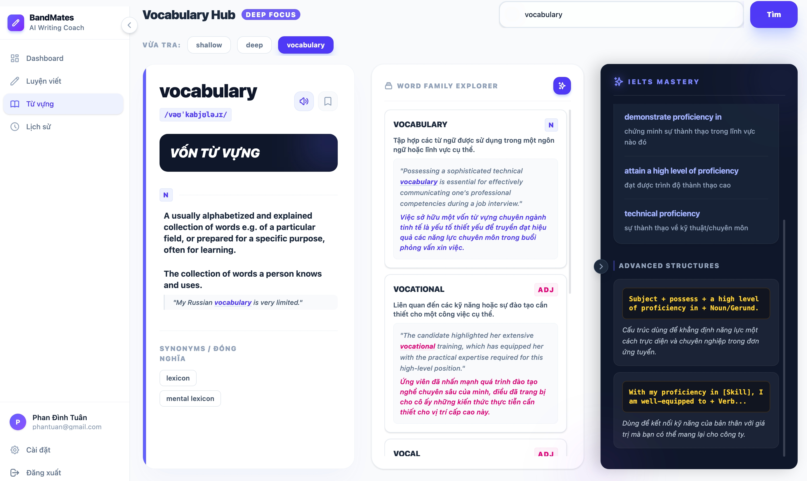
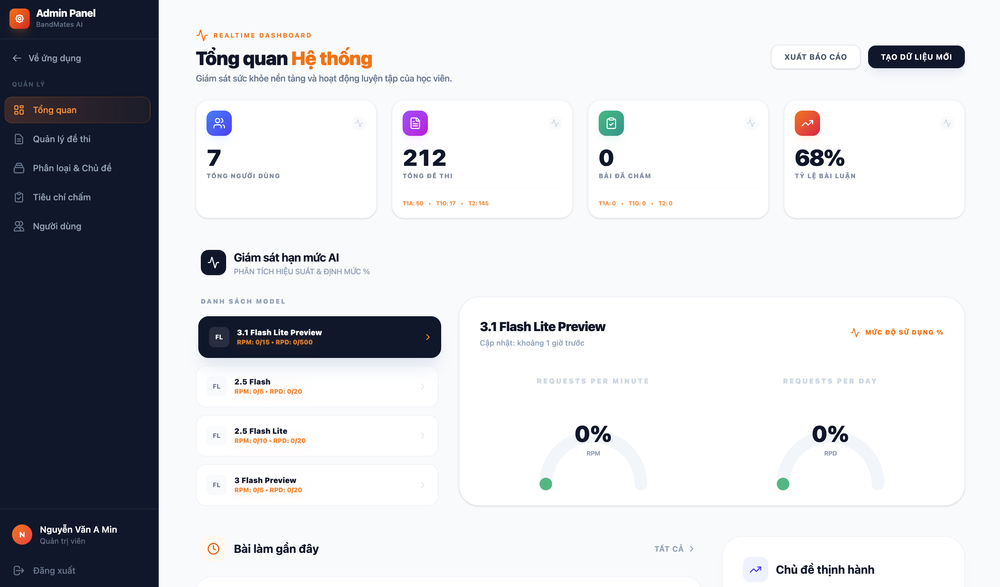
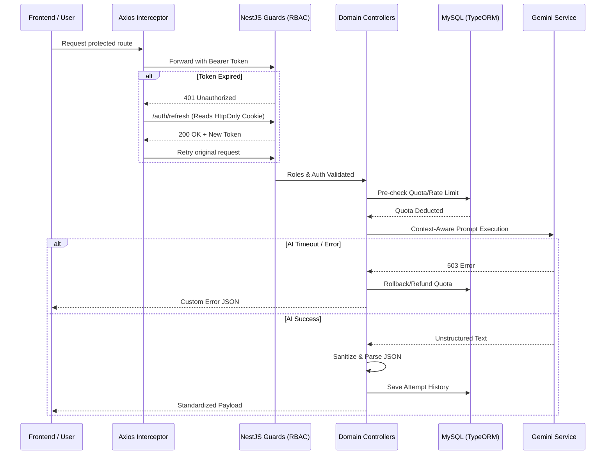
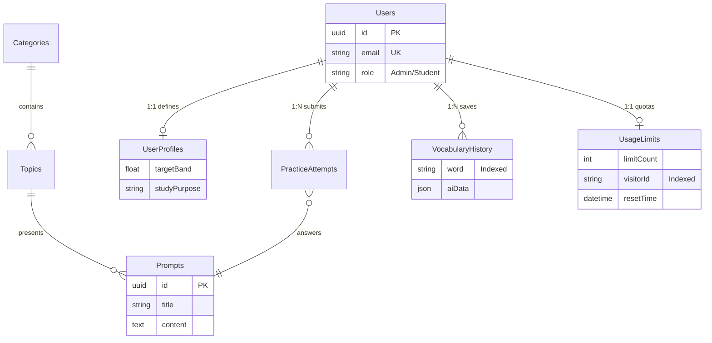

# BandMates AI ✍️
**AI-Driven IELTS Learning & Management Platform**

[]()
[]()
[]()
[]()
[]()
[]()

BandMates AI is a full-stack educational platform integrating generative AI with IELTS academic standards. Built with a focus on system resilience and maintainability, this project implements a **Modular Monolith** architecture, **Role-Based Access Control (RBAC)**, and a custom **AI Quota & Rate Limiting Engine**. It serves as a showcase of production-ready patterns for scalable backend development.

---

## 📖 Table of Contents
1. [Features Showcase](#-features-showcase)
2. [Administrative CMS](#-administrative-cms)
3. [Engineering Highlights](#-engineering-highlights)
4. [Design Philosophy](#-design-philosophy)
5. [System Architecture](#-system-architecture)
6. [Database Schema](#-database-schema)
7. [Tech Stack](#-tech-stack)
8. [Project Structure](#-project-structure)
9. [Installation & Setup](#-installation--setup)

---

## 🌟 Features Showcase

### 1. Intelligent Writing Coach
Evaluates essays strictly against IELTS criteria. The AI engine provides actionable feedback and generates an optimized "Better Version" dynamically scaled to the user's target proficiency level.



<details>
<summary><b>🎬 View User Workflow Demo</b></summary>

</details>

### 2. Vocabulary Intelligence Hub
An AI-powered lexicon featuring:
- **Automated Word-Family Expansion**: Retrieves and contextualizes related nouns, verbs, and adjectives.
- **Context-Aware Definitions**: Generates academic examples tailored to the user's `targetBand` and `studyPurpose`.
- **Bilingual Mapping**: High-fidelity exact translations for academic terms.



---

## 🛠️ Administrative CMS
A robust internal dashboard for content orchestration.
- **Content Hierarchy**: Protected CRUD operations for Categories, Topics, and Prompts.
- **RBAC Matrix**: Strict separation between Student and Administrative privileges.
- **Real-time Modulation**: Allows dynamic updates to learning materials without backend redeployment.



<details>
<summary><b>🎬 View Admin CMS Demo</b></summary>

</details>

---

## 🔥 Engineering Highlights

This project emphasizes backend stability, resource protection, and high availability.

### 1. Intelligent Rate Limiting & Quota Engine
An internal mechanism designed to enforce API limits and calculate resource consumption dynamically:
- **Algorithmic Rate Limiting (RPM/RPD)**: Implemented a custom application-layer algorithm to enforce both **Requests Per Minute (RPM)** and **Requests Per Day (RPD)** constraints simultaneously, preventing API exhaustion without relying on external cache nodes.
- **Dual-Layer Identity Tracking (VisitorID + IP)**: Engineered a hybrid guest identification system synthesizing client-generated `x-visitor-id` headers with strict server-side `ipAddress` normalization (mitigating IPv6 anomalies). This effectively counters basic cookie-wiping evasions.
- **Rolling Time-Window Calculation**: Utilizes a precision mathematical sliding window (`Date.now() - 24h`) for quota resets, eliminating the timezone desynchronization flaws common to static 0:00 midnight cron tasks.

### 2. High-Availability Generative AI Integration (LLM Resilience)
Handling non-deterministic LLM responses safely within a strict REST API environment:
- **Dynamic Model Fallback Strategy**: Engineered a self-healing pipeline where a `503 Service Unavailable` or overload error from the primary Gemini model instantly triggers a fallback mechanism to a secondary LLM tier, ensuring zero-downtime service availability.
- **Automated Compensation Transactions (Refunds)**: If the system completely fails to communicate with the AI network or intercepts a local DB cache-hit, the backend rigidly enforces a Rollback/Refund protocol to restore the user's deducted RPM/RPD quotas before returning the payload.
- **JSON Serialization & Sanitation**: Intercepts unpredictable AI outputs using strict RegEx sanitation layers to strip markdown hallucinations (` ```json `). This guarantees the TypeORM database ingests strictly valid JSON payloads, neutralizing potential data persistence anomalies.

### 3. Secure Authentication Lifecycle
- **Hybrid Token Rotation**: Secures session data by distributing short-lived Access Tokens in-memory while encapsulating stateful Refresh Tokens deep within **HttpOnly, SameSite, Secure Cookies** to mitigate XSS and CSRF attack surfaces.
- **Silent Interceptor Mesh**: A frontend network middleware designed to intercept `401 Unauthorized` responses mid-flight, secretly executing a token rotation protocol, and replaying the failed API requests without breaking the UX state.

---

## 🎯 Design Philosophy

Built adhering strictly to standard software design patterns:

- **Modular Monolith**: Codebase is separated into bounded domain modules (`Auth`, `Scoring`, `Vocabulary`, `UsageLimit`) to enforce strict **Separation of Concerns (SoC)**.
- **Dependency Injection (DI)**: Utilizes NestJS's DI container to decouple services, enhancing testability.
- **Single Responsibility Principle (SRP)**: Controllers strictly map HTTP input/output; Services process business logic; Entities exclusively bind data models.
- **Standardized API Contracts**: Enforces uniform JSON response payloads globally via custom exception filters and interceptors.

---

## 🏗️ System Architecture

<details>
<summary><b>Click to expand: Request & Authorization Flow</b></summary>


</details>

---

## 📊 Database Schema

Modeled strictly with TypeORM focusing on index optimization and relational integrity.

<details>
<summary><b>Click to expand: Show Entity Relationship Diagram</b></summary>


</details>

---

## 🛠️ Tech Stack

### Infrastructure
- **Containerization**: **Docker** & **Docker Compose**
- **Framework**: **NestJS (TypeScript)**
- **Runtime**: Node.js (v18+)

### Persistence & Security
- **Database**: **MySQL 8.0**
- **ORM**: **TypeORM** for robust schema mapping.
- **Authentication**: Passport.js with **JWT Strategy**.
- **Security Middleware**: Helmet, Cookie-Parser, CORS.

### AI & Client
- **AI Integration**: Google Gemini 3.0 Pro SDK
- **State Management**: **Zustand**
- **UI Framework**: React 19 + Vite + Tailwind CSS + Ant Design.

---

## 📂 Project Structure

```bash
backend/src/
├── modules/           # Feature-based bounded contexts
│   ├── auth/          # Authentication & Token Rotation Logic
│   ├── usage-limit-ai/# AI Quota Engine & Guest Tracking
│   ├── practice/      # Practice Execution & Essay Validation
│   ├── vocabulary/    # Vocabulary Enrichment AI Hub
│   └── .../           
├── common/            # Cross-cutting concerns
│   ├── guards/        # Authentication & RBAC protectors
│   ├── filters/       # Uniform exception handling
│   └── decorators/    # Custom metadata extraction (e.g., @VisitorId)
├── config/            # Environment validation schemas
└── main.ts            # Application bootstrap & middleware configs
```

---

## ⚡ Installation & Setup

Ensure **Node.js 18+** and **Docker Desktop** are installed.

```bash
# 1. Start MySQL infrastructure
docker-compose up -d

# 2. Clone repository & install dependencies
git clone https://github.com/nameTun/bandmates-platform.git
cd backend && npm install
cd ../frontend && npm install

# 3. Configure backend & frontend environments
# Duplicate the example templates and provide your API keys
cp backend/.env.example backend/.env
cp frontend/.env.example frontend/.env

# 4. Launch applications
cd backend && npm run start:dev
cd frontend && npm run dev
```

---

## 📬 Contact
**Phan Đình Tuân**  
*Backend Developer*

- [tuanktvn2001@gmail.com](mailto:tuanktvn2001@gmail.com)
- [LinkedIn Profile](https://www.linkedin.com/in/phan-dinh-tuan)
- [GitHub Profile](https://github.com/nameTun)