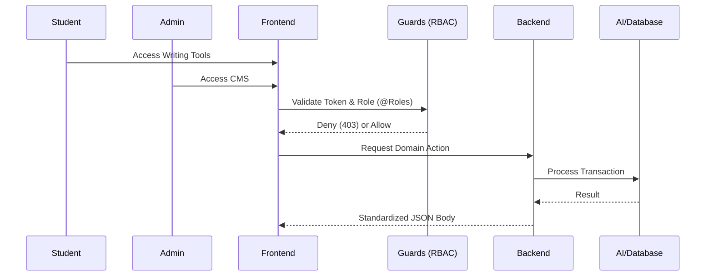
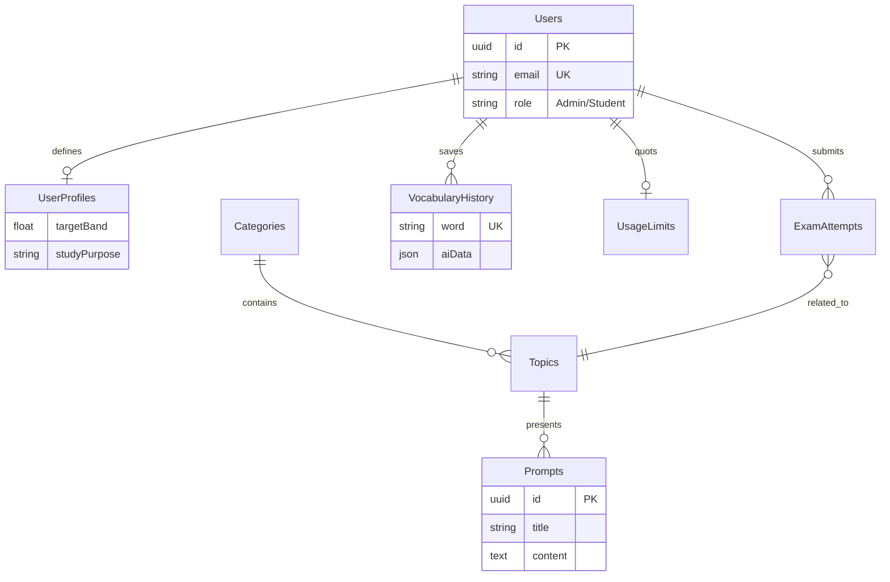

# BandMates AI ✍️
**A Comprehensive AI-Driven IELTS Learning & Management Ecosystem**

[]()
[]()
[]()
[]()
[]()

BandMates AI is more than just a writing tool; it is a full-scale educational platform designed to bridge the gap between AI intelligence and IELTS academic standards. Highlighting a **Modular Monolith** architecture, a **Role-Based Access Control (RBAC)** admin system, and a sophisticated **Vocabulary Intelligence Hub**, this project showcases production-ready solutions for complex educational challenges.

---

## 📖 Table of Contents
1. [Core Features Showcase](#-core-features-showcase)
2. [Administrative Command Center (CMS)](#-administrative-command-center-cms)
3. [Technical Deep Dives](#-technical-deep-dives)
   - [Auth & Session](#1-secure-authentication--session-lifecycle)
   - [AI Prompt Engineering](#2-strategic-ai-prompt-engineering)
   - [Guest vs User Management](#3-multi-tiered-usage-management)
4. [Design Philosophy](#-design-philosophy)
5. [System Architecture](#-system-architecture)
6. [Project Structure](#-project-structure)
7. [Database Schema (ERD)](#-database-schema-erd)
8. [Tech Stack](#-tech-stack)
9. [Installation & Setup](#-installation--setup)
10. [Authors](#-authors)

---

## 🌟 Core Features Showcase

### 1. Intelligent Writing Coach
Evaluating essays based on official IELTS descriptors. The AI doesn't just grade—it coaches by providing a **"Better Version"** at a strategic difficulty level to push the student further.
> *[INSERT SCREENSHOT: Practice Essay Analysis]*

### 2. Vocabulary Intelligence Hub
Go beyond simple definitions. This module leverages AI to provide:
- **Automatic Word-Family Expansion**: Helping students learn related nouns, verbs, and adjectives.
- **Contextual Academic Usage**: Real-world examples tailored to the user's specific **Target Band** and **Study Purpose** (Business, Education, or Immigration).
- **Vietnamese Bilingual Explanations**: Ensuring zero ambiguity for learners.
> *[INSERT SCREENSHOT: Vocabulary Analysis Hub]*

---

## 🛠️ Administrative Command Center (CMS)
A robust internal tool for content managers to orchestrate the platform's educational material.
- **Content Hierarchy Management**: Manage Categories, Topics, and Prompts through a protected CRUD interface.
- **Role-Based Access Control (RBAC)**: Secure separation between Student interfaces and Administrative controls.
- **Real-time Moderation**: Immediate updates to practice materials without redeploying the backend.
> *[INSERT SCREENSHOT: Admin Dashboard / Prompt Management]*

---

## 🔥 Technical Deep Dives

### 1. Secure Authentication & Session Lifecycle
- **JWT Rotation Policy**: Short-lived Access Tokens paired with stateful Refresh Tokens.
- **Security-First Storage**: Refresh Tokens are persisted in **HttpOnly, Secure, SameSite Cookies**, providing a defense-in-depth against XSS and CSRF.
- **Silent Refresh Interceptors**: A custom frontend interceptor pattern handles expired sessions automatically, ensuring zero friction for the user.

### 2. Strategic AI Prompt Engineering
- **Personalization Engine**: Prompts are dynamically injected with user profile data (`targetBand`, `studyPurpose`) to ensure feedback is neither too easy nor too difficult.
- **Resource Guarding**: A custom database-driven usage tracking system prevents AI quota abuse and ensures service sustainability.

### 3. Multi-Tiered Usage Management
The system differentiates between **Guests** and **Authenticated Users** to balance service accessibility with resource costs:
- **Guest Access**: IP-based rate limiting, allowing limited AI evaluation without registration.
- **Authenticated Access**: Tiered usage quotas, persistent history tracking, and personalized learning profiles.
- **Quota Guard**: A custom background logic that resets limits periodically and prevents API over-utilization.

---

## 🎯 Design Philosophy

This project is built with a focus on long-term maintainability and scalability, adhering to industry-standard design principles:

- **Modular Monolith**: Organized by self-contained domain modules (`Auth`, `Scoring`, `Vocabulary`) to ensure a high level of **Separation of Concerns (SoC)**.
- **Dependency Injection (DI)**: Leveraging NestJS's core DI container to produce loosely coupled and highly testable components.
- **Single Responsibility Principle (SRP)**: Distinct separation between HTTP delivery layers (Controllers) and Business Logic layers (Services).
- **Clean API Design**: Standardized JSON response structures and centralized error handling via Global Exception Filters for a consistent developer experience.

---

## 🏗️ System Architecture

### Request & Authorization Flow


---

## 📊 Database Schema (ERD)



---

## 📂 Project Structure

The project follows a **Layered Architecture** within a **Modular Monolith** structure, ensuring that business logic is decoupled from technical implementation.

### Backend Overview
```bash
backend/src/
├── modules/           # Feature-based modules (Domain-driven)
│   ├── auth/          # Authentication & Security logic
│   ├── scoring/       # AI Scoring & Evaluation domain
│   ├── vocabulary/    # Vocabulary AI Hub domain
│   └── .../           # Other self-contained modules
├── common/            # Cross-cutting concerns (Global scope)
│   ├── guards/        # Authentication & RBAC protectors
│   ├── filters/       # Global exception handling
│   └── decorators/    # Custom metadata decorators
├── config/            # Strict environment validation schema
└── main.ts            # Application bootstrap & middleware config
```

### Applied Design Patterns
- **Provider Pattern**: Leveraging NestJS's DI to manage service lifetimes.
- **Factory Pattern**: Used in AI module configuration to initialize different models dynamically.
- **Decorator Pattern**: Extensive use of TypeScript decorators for metadata-driven development (e.g., `@Roles`, `@GetUser`).
- **Data Mapper Pattern**: TypeORM entities separation from business logic for cleaner data transitions.

---

## 🛠️ Tech Stack

### Infrastructure & DevOps
- **Containerization**: **Docker** & **Docker Compose** for seamless database orchestration.
- **Framework**: **NestJS (TypeScript)** - Scalable Modular Monolith architecture.
- **Runtime**: Node.js (v18+)

### Persistence & Security
- **Database**: **MySQL** + **TypeORM** (Relational Integrity).
- **Authentication**: Passport.js with **JWT Strategy**.
- **Middleware**: Helmet (Security Headers), Cookie-Parser.

### AI & Frontend
- **AI Core**: Google Gemini 3.0 Pro (Strategic AI Orchestration).
- **State Management**: **Zustand** (Predictable State).
- **UI System**: React 19 + Vite + Tailwind CSS + Ant Design.

---

## ⚡ Installation & Setup

### 1. Prerequisite
Ensure you have **Node.js 18+** and **Docker Desktop** installed and running on your machine.

### 2. Infrastructure Setup (Docker First)
The project uses Docker to orchestrate the database environment. Run the following command to start the infrastructure:
```bash
# Start MySQL 8.0 container in detached mode
docker-compose up -d

# Verify that the container is running
docker ps
```

### 3. Application Installation
Once the database is up, install dependencies for both layers:
```bash
# Clone the repository
git clone https://github.com/nameTun/bandmates-platform.git

# Install Backend & Frontend dependencies
cd backend && npm install
cd ../frontend && npm install
```

### 4. Configuration & Launch
1. Create a `.env` file in the `backend` folder (refer to `.env.example`).
2. Launch the development servers:
```bash
# Terminal 1: Backend
cd backend && npm run start:dev

# Terminal 2: Frontend
cd frontend && npm run dev
```

---

## 📬 Contact
**Phan Đình Tuân**  
*Backend Developer Specializing in Node.js & AI Systems*

- [tuanktvn2001@gmail.com](mailto:tuanktvn2001@gmail.com)
- [LinkedIn Profile](https://www.linkedin.com/in/phan-dinh-tuan)
- [GitHub Profile](https://github.com/nameTun)