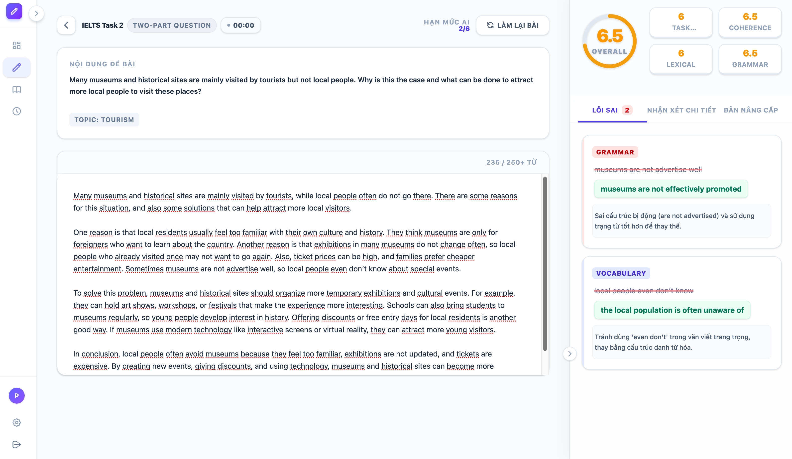
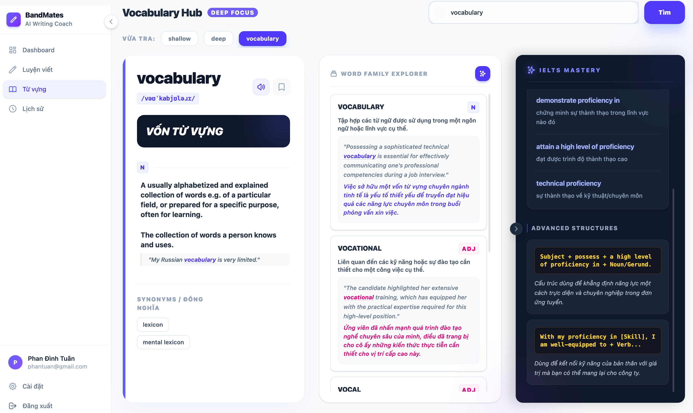
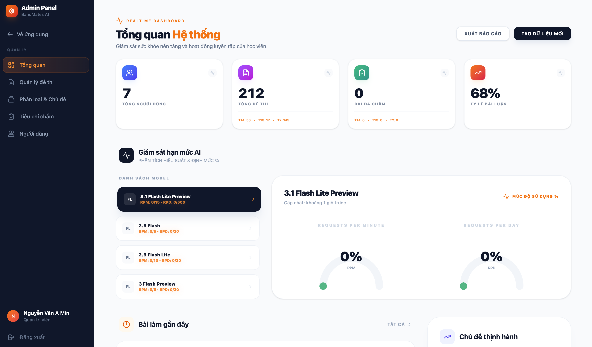
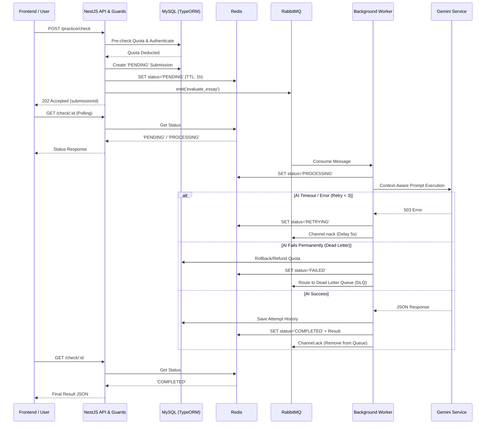
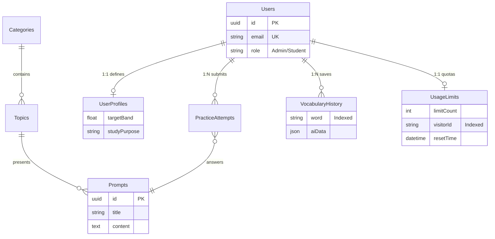

# BandMates AI ✍️

**AI-Driven IELTS Learning & Management Platform**

     

BandMates AI is a full-stack educational platform integrating generative AI with IELTS academic standards. Built with a focus on system resilience and maintainability, this project implements a **Modular Monolith** architecture, **Role-Based Access Control (RBAC)**, and a custom **AI Quota & Rate Limiting Engine**. It serves as a showcase of production-ready patterns for scalable backend development.

---

## 📖 Table of Contents

1. [Features Showcase](#-features-showcase)
2. [Administrative CMS](#-administrative-cms)
3. [System Architecture & Engineering](#-system-architecture--engineering)
4. [Design Philosophy](#-design-philosophy)
5. [System Architecture](#-system-architecture)
6. [Database Schema](#-database-schema)
7. [Tech Stack](#-tech-stack)
8. [Project Structure](#-project-structure)
9. [Installation & Setup](#-installation--setup)

---

## 🌟 Features Showcase

### 1. Intelligent Writing Coach

Evaluates essays strictly against IELTS criteria. The AI engine provides actionable feedback and generates an optimized "Better Version" dynamically scaled to the user's target proficiency level.



**🎬 View User Workflow Demo**


### 2. Vocabulary Intelligence Hub

An AI-powered lexicon featuring:

- **Automated Word-Family Expansion**: Retrieves and contextualizes related nouns, verbs, and adjectives.
- **Context-Aware Definitions**: Generates academic examples tailored to the user's `targetBand` and `studyPurpose`.
- **Bilingual Mapping**: High-fidelity exact translations for academic terms.



---

## 🛠️ Administrative CMS

A robust internal dashboard for content orchestration.

- **Content Hierarchy**: Protected CRUD operations for Categories, Topics, and Prompts.
- **RBAC Matrix**: Strict separation between Student and Administrative privileges.
- **Real-time Modulation**: Allows dynamic updates to learning materials without backend redeployment.



**🎬 View Admin CMS Demo**


---

## 🔥 System Architecture & Engineering

This project emphasizes backend stability, resource optimization, and fault tolerance. The core engineering challenge addressed is the integration of non-deterministic, high-latency Large Language Models (LLMs) within a strict RESTful API environment.

### 1. Mitigating LLM Latency Bottlenecks via Event-Driven Architecture
- **Problem Formulation:** Direct synchronous HTTP requests to 3rd-party LLM providers (e.g., Gemini) introduce significant latency (10s - 15s), leading to critical bottlenecks such as socket exhaustion and Gateway Timeouts (504) on PaaS environments like Vercel/Render.
- **Architectural Solution:** The system decouples the HTTP transport layer from the AI processing layer utilizing **RabbitMQ** as an asynchronous message broker. The REST controller immediately acknowledges requests with an `HTTP 202 Accepted` status, while a Background Worker consumes messages for heavy lifting. **Redis** is implemented to synchronize processing state, enabling efficient client-side polling.
- **Performance Evaluation:** This structural shift reduces perceived API response time from ~15s to ~150ms (a ~100x latency reduction), enabling the system to sustain high concurrent throughput without blocking the Node.js event loop.

### 2. Fault Tolerance & Data Integrity (Resilience Mechanisms)
- **Problem Formulation:** AI service disruptions or rate-limiting responses can cause silent data loss or unfairly penalize the user's daily quota.
- **Architectural Solution:** 
  - **Dead Letter Routing & Retry Policies:** Implemented a robust local retry mechanism (max 3 attempts). Unresolvable messages are routed to a **Dead Letter Queue (DLQ)** for manual inspection, ensuring zero data loss.
  - **Compensation Transactions:** Engineered an automated rollback protocol that immediately refunds the user's deducted Request Quota before persisting the failed state.
  - **Payload Sanitation:** Enforces strict RegEx sanitation layers on unpredictable LLM outputs to strip markdown hallucinations (` ```json `), ensuring TypeORM only ingests structurally valid JSON payloads.

### 3. Resource Optimization & Rate Limiting Algorithm
- **Problem Formulation:** Protecting expensive AI API endpoints from abuse by stateless guests while accommodating timezone variations for quota resets.
- **Architectural Solution:** 
  - **Sliding Window Algorithm:** Replaced conventional midnight-reset cronjobs with a precision mathematical sliding window (`Date.now() - 24h`) to calculate Requests Per Day (RPD) and Requests Per Minute (RPM) limits dynamically.
  - **Dual-Layer Tracking:** Deployed a hybrid identification matrix synthesizing client-generated `x-visitor-id` headers with normalized server-side `ipAddress` extraction, mitigating basic cookie-wiping exploits.

### 4. Authentication & Session Security Lifecycle
- **Architectural Solution:** Adopted a **Hybrid Token Rotation** model. Short-lived Access Tokens reside strictly in-memory (Zustand), while stateful Refresh Tokens are encapsulated within **HttpOnly, SameSite, Secure Cookies** to minimize XSS and CSRF attack vectors. A frontend "Silent Interceptor Mesh" intercepts `401 Unauthorized` responses mid-flight, executes background token rotation, and replays failed API calls to maintain a seamless UX.

---

## 🎯 Design Philosophy

Built adhering strictly to standard software design patterns:

- **Modular Monolith**: Codebase is separated into bounded domain modules (`Auth`, `Scoring`, `Vocabulary`, `UsageLimit`) to enforce strict **Separation of Concerns (SoC)**.
- **Dependency Injection (DI)**: Utilizes NestJS's DI container to decouple services, enhancing testability.
- **Single Responsibility Principle (SRP)**: Controllers strictly map HTTP input/output; Services process business logic; Entities exclusively bind data models.
- **Standardized API Contracts**: Enforces uniform JSON response payloads globally via custom exception filters and interceptors.

---

## 🏗️ System Architecture

**Request & Authorization Flow**


```mermaid
sequenceDiagram
    participant Client as Frontend / User
    participant Gate as NestJS API & Guards
    participant DB as MySQL (TypeORM)
    participant Cache as Redis
    participant MQ as RabbitMQ
    participant Worker as Background Worker
    participant AI as Gemini Service

    Client->>Gate: POST /practice/check
    
    %% Authorization & Rate Limiting
    Gate->>DB: Pre-check Quota & Authenticate
    DB-->>Gate: Quota Deducted
    
    %% Initial Response
    Gate->>DB: Create 'PENDING' Submission
    Gate->>Cache: SET status='PENDING' (TTL: 1h)
    Gate->>MQ: emit('evaluate_essay')
    Gate-->>Client: 202 Accepted (submissionId)
    
    %% Client Polling
    Client->>Gate: GET /check/:id (Polling)
    Gate->>Cache: Get Status
    Cache-->>Gate: 'PENDING' / 'PROCESSING'
    Gate-->>Client: Status Response
    
    %% Background Processing
    MQ->>Worker: Consume Message
    Worker->>Cache: SET status='PROCESSING'
    Worker->>AI: Context-Aware Prompt Execution
    
    alt AI Timeout / Error (Retry < 3)
        AI-->>Worker: 503 Error
        Worker->>Cache: SET status='RETRYING'
        Worker->>MQ: Channel.nack (Delay 5s)
    else AI Fails Permanently (Dead Letter)
        Worker->>DB: Rollback/Refund Quota
        Worker->>Cache: SET status='FAILED'
        Worker->>MQ: Route to Dead Letter Queue (DLQ)
    else AI Success
        AI-->>Worker: JSON Response
        Worker->>DB: Save Attempt History
        Worker->>Cache: SET status='COMPLETED' + Result
        Worker->>MQ: Channel.ack (Remove from Queue)
    end
    
    %% Final Client Poll
    Client->>Gate: GET /check/:id
    Gate->>Cache: Get Status
    Cache-->>Gate: 'COMPLETED'
    Gate-->>Client: Final Result JSON
```

---

## 📊 Database Schema

Modeled strictly with TypeORM focusing on index optimization and relational integrity.

**Entity Relationship Diagram**


```mermaid
erDiagram
    Users ||--o| UserProfiles : "1:1 defines"
    Users ||--o{ PracticeAttempts : "1:N submits"
    Users ||--o{ VocabularyHistory : "1:N saves"
    Users ||--o| UsageLimits : "1:1 quotas"
    
    Users {
        uuid id "PK"
        string email "UK"
        string role "Admin/Student"
    }

    Categories ||--o{ Topics : "contains"
    Topics ||--o{ Prompts : "presents"
    PracticeAttempts }o--|| Prompts : "answers"

    Prompts {
        uuid id "PK"
        string title
        text content
    }

    UserProfiles {
        float targetBand
        string studyPurpose
    }

    VocabularyHistory {
        string word "Indexed"
        json aiData
    }
    
    UsageLimits {
        int limitCount
        string visitorId "Indexed"
        datetime resetTime
    }
```

---

## 🛠️ Tech Stack

### Infrastructure

- **Containerization**: **Docker** & **Docker Compose**
- **Framework**: **NestJS (TypeScript)**
- **Message Broker**: **RabbitMQ** (Reliability & Async Processing)
- **Runtime**: Node.js (v18+)

### Persistence & Security

- **Database**: **MySQL 8.0**
- **In-Memory Cache**: **Redis** (Status Polling & Vocabulary Caching)
- **ORM**: **TypeORM** for robust schema mapping.
- **Authentication**: Passport.js with **JWT Strategy**.
- **Security Middleware**: Helmet, Cookie-Parser, CORS.

### AI & Client

- **AI Integration**: Google Gemini 3.0 Pro SDK
- **State Management**: **Zustand**
- **UI Framework**: React 19 + Vite + Tailwind CSS + Ant Design.

---

## 📂 Project Structure

```bash
backend/src/
├── modules/           # Feature-based bounded contexts
│   ├── queue/         # RabbitMQ Registration & Config
│   ├── auth/          # Authentication & Token Rotation Logic
│   ├── usage-limit-ai/# AI Quota Engine & Guest Tracking
│   ├── practice/      # Practice Controllers & Background Workers
│   ├── vocabulary/    # Vocabulary Enrichment AI Hub
│   └── .../           
├── common/            # Cross-cutting concerns
│   ├── guards/        # Authentication & RBAC protectors
│   ├── filters/       # Uniform exception handling
│   └── decorators/    # Custom metadata extraction (e.g., @VisitorId)
├── config/            # Environment validation schemas
└── main.ts            # Application bootstrap & middleware configs
```

---

## ⚡ Installation & Setup

Ensure **Node.js 18+** and **Docker Desktop** are installed.

```bash
# 1. Start Infrastructure (MySQL, Redis, RabbitMQ)
docker-compose up -d

# 2. Clone repository & install dependencies
git clone https://github.com/nameTun/bandmates-platform.git
cd backend && npm install
cd ../frontend && npm install

# 3. Configure backend & frontend environments
# Duplicate the example templates and provide your API keys
cp backend/.env.example backend/.env
cp frontend/.env.example frontend/.env

# 4. Launch applications
cd backend && npm run start:dev
cd frontend && npm run dev
```

---

## 📬 Contact

**Phan Đình Tuân**\
*Backend Developer*

- [tuanktvn2001@gmail.com](mailto:tuanktvn2001@gmail.com)
- [LinkedIn Profile](https://www.linkedin.com/in/phan-dinh-tuan)
- [GitHub Profile](https://github.com/nameTun)